# Spartamarket_DRF
## 심화 개인과제

### 프로젝트 개요
* DRF!! 뽀개봅시다!!

### ERD

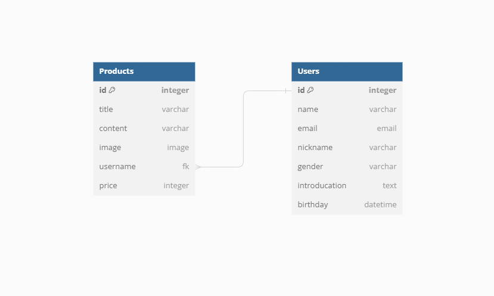

### 기술 스택
---

 

 

 

<h1>Accounts</h1>

#### 회원가입
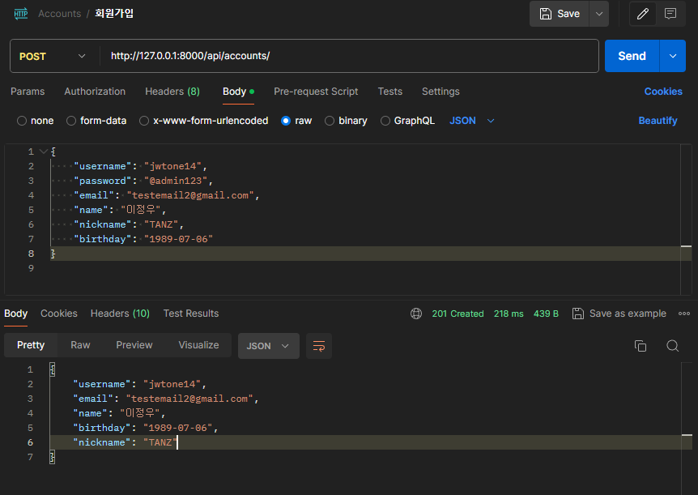
- 과제에서 요청한 검증 및 구현 완료

#### 로그인
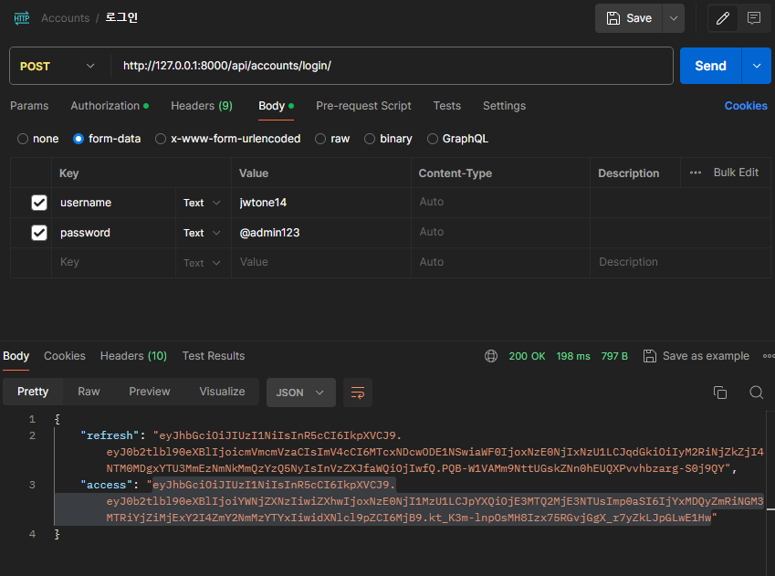
- 과제에서 요청한 검증 및 구현 완료

#### 프로필 조회
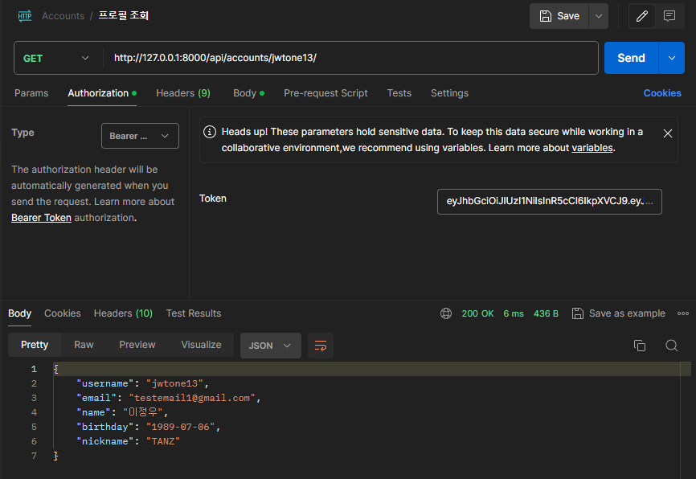
- 과제에서 요청한 검증 및 구현 완료

#### 로그아웃
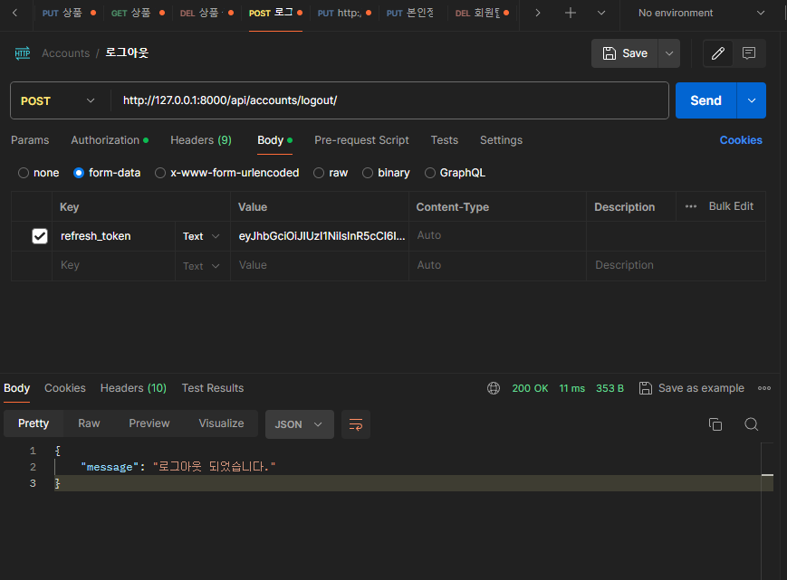
- 과제에서 요청한 검증 및 구현 완료

#### 본인 정보 수정
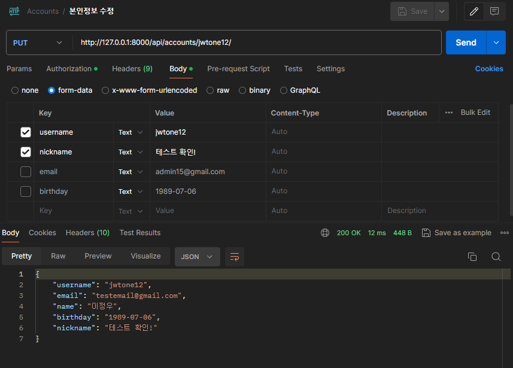
- 과제에서 요청한 검증 및 구현 완료

#### 패스워드 변경
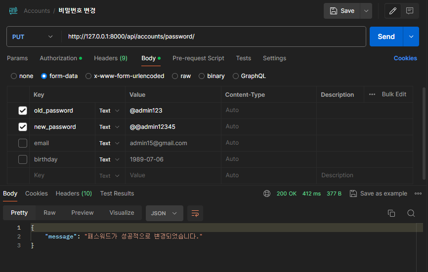
- 과제에서 요청한 검증 및 구현 완료

<h1>Products</h1>

#### 상품 등록
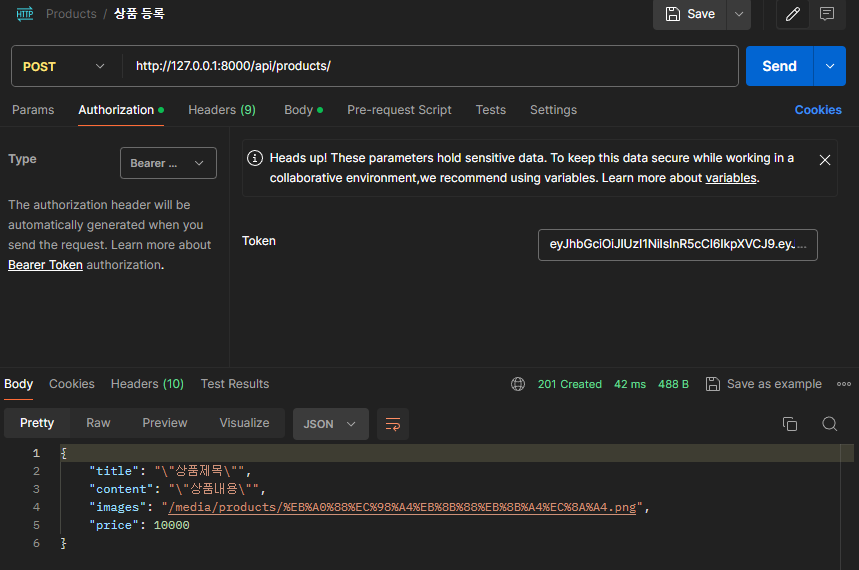
- 과제에서 요청한 검증 및 구현 완료

#### 상품 목록 조회
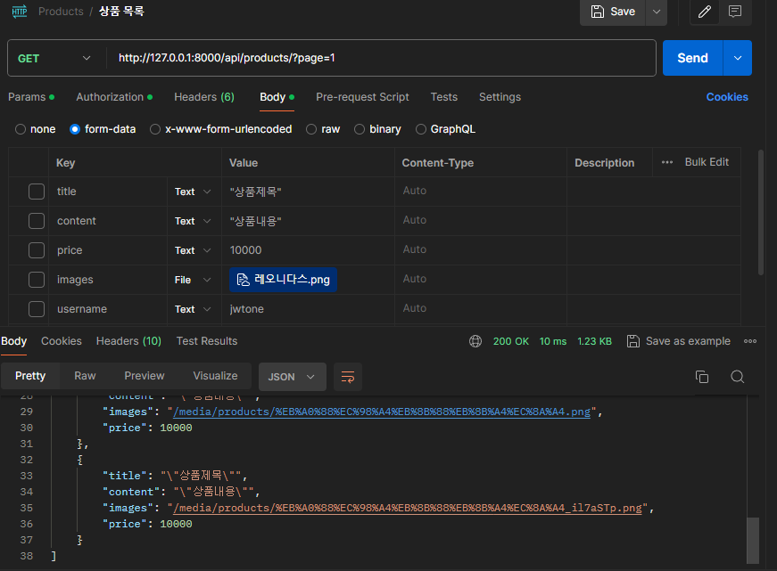
- 페이지네이션 적용완료
- 그외 검증 및 구현 완료

#### 상품수정
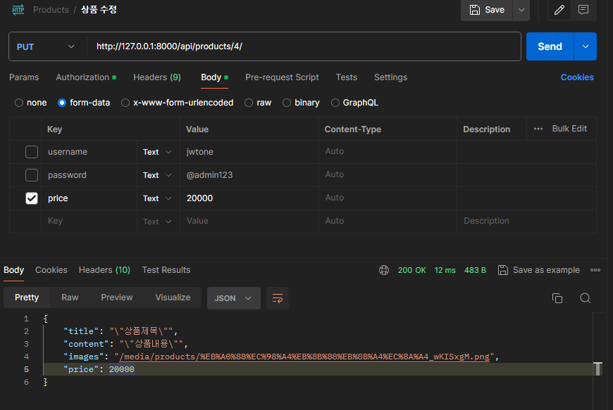
- 과제에서 요청한 검증 및 구현 완료

#### 상품삭제
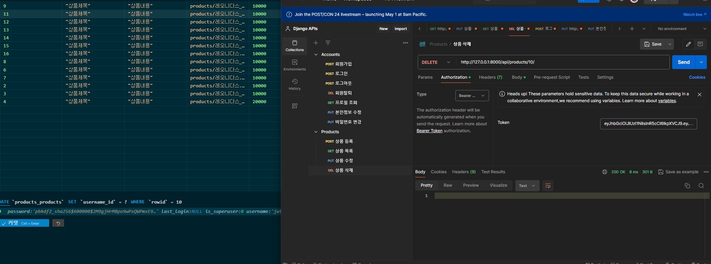
- 10번품목 삭제한 스크린샷
- 그밖에 요청한 검증 및 구현 완료

